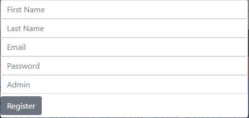
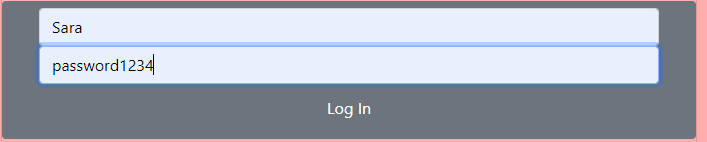
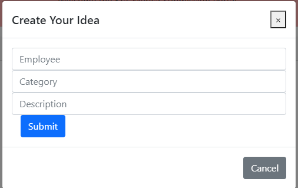
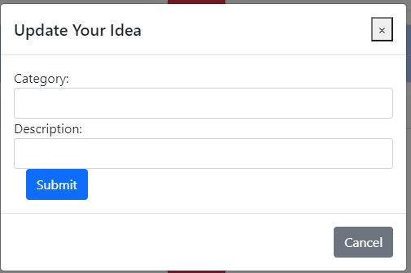
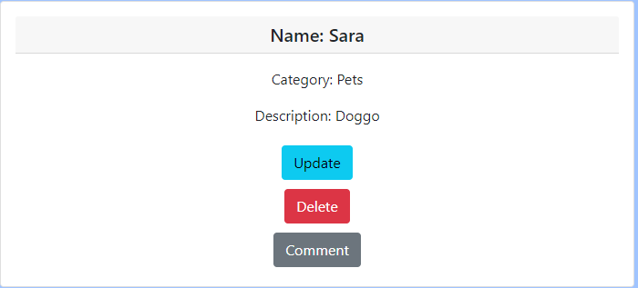
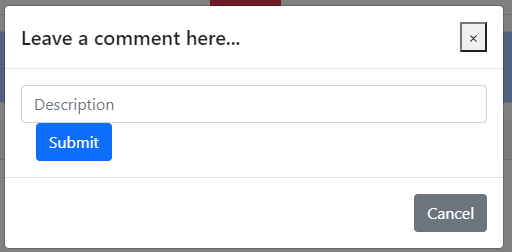
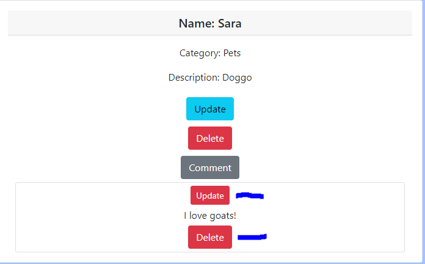

Kra-Merica Employee Submission Portal

# Overview

This project was designed to be a fun homage to the 90's sitcom Seinfeld. The client-side of the project used class components to build out the layout of what the user would see on the browser. The client side implemented Reactstrap as the styling library. 

A user is able to create, read, update, and delete posts that they make. They can also add comments to posts of which they can read, update, and delete. 

## Installation

To get the same features install the dependencies below:

## Demo

Here are some of the features from the Client side:

Register:

Login:

Create Idea:

Update Idea:

Delete Idea:

Create Comment:

Update Comment:

Delete Comment:

## Frameworks used

React:
	Class Components
    Routing the app from parent components
	Passing props to children components

Reactstrap:
	Installed Reactrap
	Imported components from library
	Called it inside the return

GitHub:
	Created repo's

Heroku:
	Deployed to Heroku
